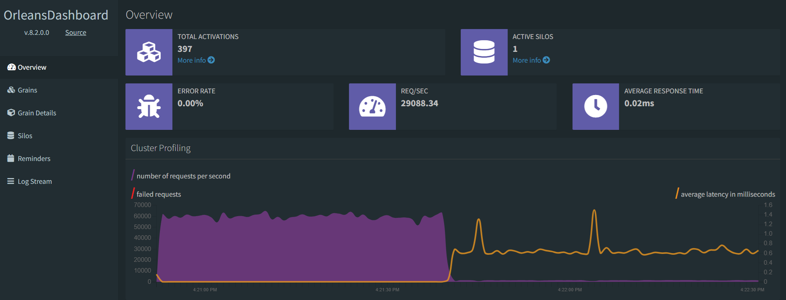

# Trading Terminal and Backtester

All-in-one. 
Trading terminal with generic gateway implementation, tick backtester, charting, and performance evaluator for trading strategies.
Supports stocks, FX, options, and futures with experimental support for crypto-currencies. 
May contain references to other libraries in [this list](https://github.com/Indemos) that were not included in this repository.

# Status 

# Structure

* **Core** - cross-platform .NET Core library with main functionality 
* **Data** - historical ticks for backtester in ZIP, JSON or Message Pack format + custom parsers
* **Gateways** - gateway implementations for brokers and exchanges, including simulated data
* **Dashboard** - UI for strategies visualizing orders, positions, and performance metrics 

The core library already implements a set of Orleans grains and services that can be inherited and extended when integrating new gateways.

* **DomGrain** - order book storage
* **InstrumentGrain** - instrument storage and price aggregator
* **OptionsGrain** - option chain storage
* **OrderGrain** - storage for a single distributed order
* **OrdersGrain** - order manager tracking active orders
* **PositionGrain** - storage for a single distributed position
* **PositionsGrain** - position manager tracking open positions
* **TransactionGrain** - storage for a single distributed transaction
* **TransactionsGrain** - transactions manager tracking closed positions

# Gateways 

* Interactive Brokers
* Simulation - virtual orders and market data 

In order to create connector for preferred broker, implement interface `IGateway`.

# Migration

The application is being migrated to Orleans to simplify maintenance and tracking with extension to fully distributed framework. 
Gateways below are still being migrated. 
Previous implementation with already implemented gateways is available in the `gateways` branch.

* Tradier
* Schwab
* Alpaca

# Trading Strategies

[Examples](https://github.com/Indemos/Terminal/tree/main/Terminal/Pages) of simple trading strategies can be found in `Terminal` catalog.

# Preview 

# Administration panel

Orleans dashboard module is used as a simple administration panel to check server health, latency, and internal state of specific grains, e.g. orders and positions. 

