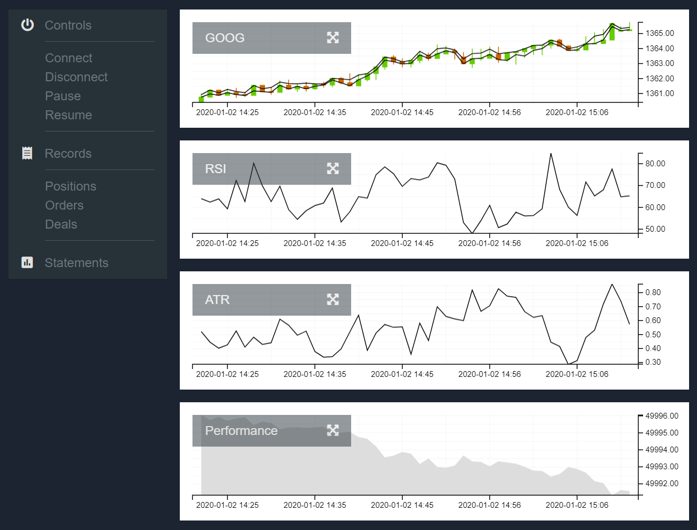
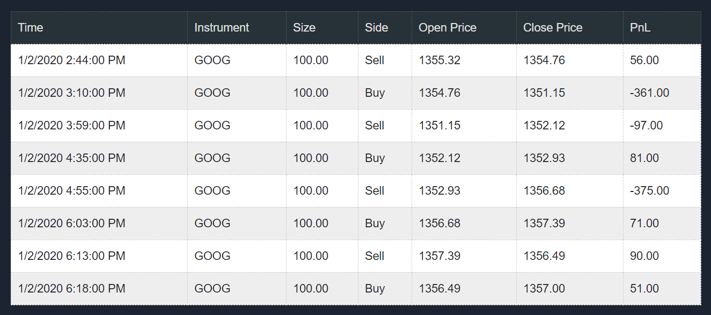
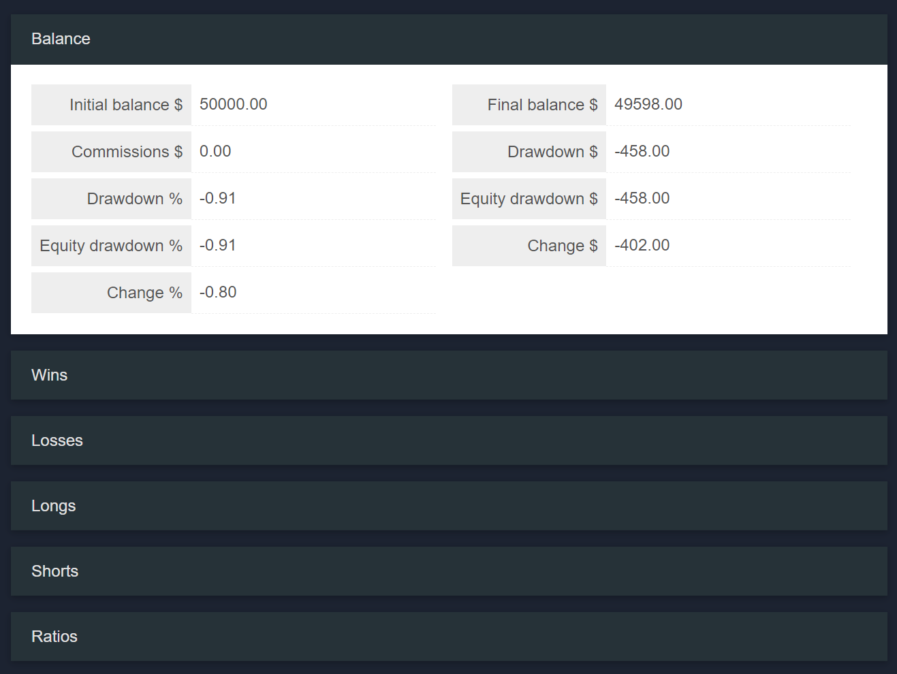

# Stock Trader - Web Version

Experimental Blazor app that can connect to various trading gateway, receive quotes, and send orders. 
In this version, only simulated gateway with preloaded quotes is available. 
For the best experience open it in Chrome, other browsers were not tested.

# Disclaimer

**This version is not maintained anymore**. 

There is a couple of synchronization issues with async queries clean-up after continuous connecting and disconnecting from gateway. This and some other missing features in Blazor, like missing interaction with cookies, makes Blazor look not ready for using in production.

# Dashboard

 

# Records 

# Statements 

