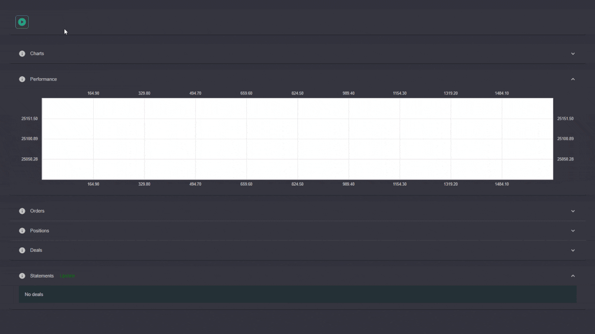

# Trading Terminal and Backtester - Web Version

All-in-one. 
Trading terminal with generic gateway implementation, tick backtester, charting, and performance evaluator for trading strategies.
Currently, supports stocks with experimental extension for FX, options, and futures. 

# Status 

# Disclaimer

The app is in active development state and can be updated without any notice. 
May contain references to other apps in [this list](https://github.com/Indemos) that were NOT included in the current repository.

# Structure

* **Core** - cross-platform .NET 5 class library that contains main functionality 
* **Chart** - [canvas](https://github.com/Indemos/Canvas) visualization
* **Tests** - unit tests 
* **Score** - class library measuring performance metrics and related statstics
* **Data** - catalog with historical data, any format is acceptable as long as you implement your own parser
* **Connector** - gateway implementations for brokers and exchanges, including historical and simulated data
* **Client** - the main application that puts together orders, positions, performance metrics, and charts 

# Gateways 

In order to create connector for preferred broker, implement interface `IConnectorModel`.

# Trading Strategies

[Examples](https://github.com/Indemos/Terminal/tree/main/Terminal.Client/Pages) of simple trading strategies can be found in `Client` catalog.

# Preview 

