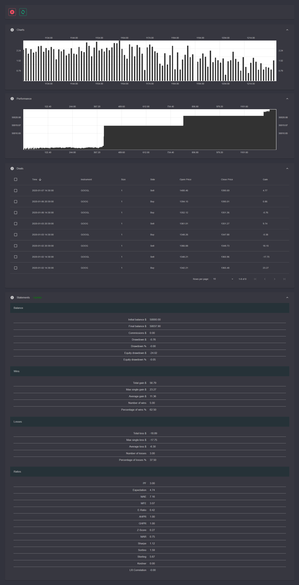
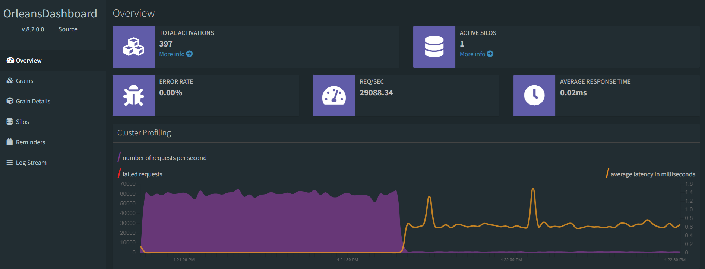

# Trading Terminal and Backtester

All-in-one. 
Trading terminal with generic gateway implementation, tick backtester, charting, and performance evaluator for trading strategies.
Supports stocks, FX, options, and futures with experimental support for crypto-currencies. 
May contain references to other libraries in [this list](https://github.com/Indemos) that were not included in this repository.

# Status 

# Structure

* **Core** - cross-platform .NET Core library with main functionality 
* **Data** - historical ticks for backtester in Lite DB, ZIP, JSON, Message Pack + custom parsers
* **Gateways** - gateway implementations for brokers and exchanges, including simulated data
* **Dashboard** - UI for strategies visualizing orders, positions, and performance metrics 

The core library already implements a set of Orleans grains and services that can be inherited and extended when integrating new gateways.

* **DomGrain** - order book storage
* **InstrumentGrain** - instrument storage and price aggregator
* **OptionsGrain** - option chain storage
* **OrdersGrain** - order manager tracking active orders
* **PositionsGrain** - position manager tracking open positions
* **TransactionsGrain** - transactions manager tracking closed positions

# Gateways 

Already implemented gateways.

* Schwab
* Topstep
* Tradier
* Interactive Brokers
* Alpaca - in the `gateways` branch
* Simulation - virtual orders and market data 

In order to create connector for preferred broker, implement interface `IGateway`.

# Trading Strategies

[Examples](https://github.com/Indemos/Terminal/tree/main/Terminal/Pages) of simple trading strategies can be found in `Dashboard` pages folder.

# Historical quotes 

Historical 1 second quotes for ES and NQ are available at links below. 
When running simulator, set `Source` property to the folder with files below. 
Each DB file should have the name of the security being traded, e.g. ES.db and NQ.db respectively.

* [ES](https://1drv.ms/u/c/e7ca1261cd1ac578/IQDb5Gffmz58Q7vBG9BGK-ChAfhSsBxdk8-qBwzaXieVH5M?e=oikxHJ)
* [NQ](https://1drv.ms/u/c/e7ca1261cd1ac578/IQAo3WQniKWdTqdNmzSfLcL_AQGiLCFJ8eWq67iD8_Kbf8I?e=aUEZ83)

# Preview 

# Administration

Orleans dashboard module is used as a simple administration panel to check server health, latency, and internal state of specific grains, e.g. orders and positions. 
Dashboard is available at `http://localhost:5000/processors`

