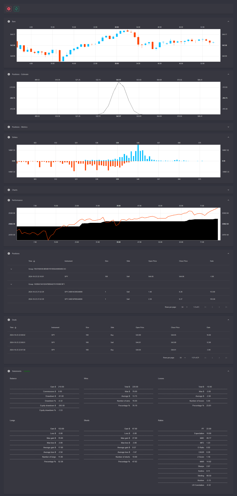

# Trading Terminal and Backtester

All-in-one. 
Trading terminal with generic gateway implementation, tick backtester, charting, and performance evaluator for trading strategies.
Supports stocks, FX, options, and futures with experimental support for crypto-currencies. 
May contain references to other libraries in [this list](https://github.com/Indemos) that were not included in this repository.

# Status 

# Structure

* **Core** - cross-platform .NET Core class library with main functionality 
* **Chart** - [canvas](https://github.com/Indemos/Canvas) visualization
* **Estimator** - class [library](https://github.com/Indemos/Estimator) measuring performance metrics, options, cointegration
* **Data** - quotes as CSV for stocks and JSON in ZIP for options, can write custom parser for other formats
* **Gateway** - gateway implementations for brokers and exchanges, including historical and simulated data
* **Terminal** - application that puts together orders, positions, performance metrics, and charts 
* **Derivative** - application visualizing data option metrics, portfolio builder, etc

# Gateways 

* Interactive Brokers
* Tradier
* Schwab
* Alpaca
* Simulation - virtual orders and market data 

In order to create connector for preferred broker, implement interface `IGateway`.

# Trading Strategies

[Examples](https://github.com/Indemos/Terminal/tree/main/Terminal/Pages) of simple trading strategies can be found in `Terminal` catalog.

# Preview 

